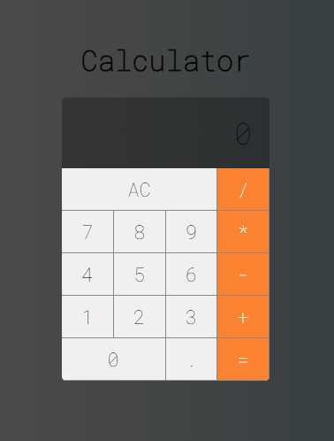

# Calculator
#### Usando React

Calculadora básica - desenvolvida seguindo a seção 3: projeto calculadora, do "curso de React do Leonardo Moura Litão"



## Tech

- React
- JavaScript
- HTML5
- CSS3

## Installation

Necessitado [Node.js](https://nodejs.org/) v10+ para rodar

Você pode rodar o projeto:
```sh
cd calculator
npm start
```

Rodando o app no development mode.\
Abra [http://localhost:3000](http://localhost:3000) para visualizar ele em seu browser.

## License

MIT

**Free Software**
